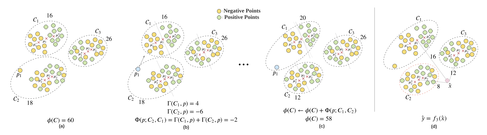

CAC
======

CAC is a clustering based framework for classification. The framework proceeds in 2 phases, training and testing as follow:-



## Demo
Run `python3 CAC_experiments.py --init KM --verbose False --classifier LR --dataset adult --cv False --alpha 0.01`


## Command line options
  * `--dataset`: The dataset to be used for training. Choices 'adult', 'credit', 'titanic', 'magic', 'cic' (default 'ALL')
  * `--alpha`: The alpha value to be used. (default: 0.01)
  * `--classifier`: The base classifier to be used with CAC. (default: LR)
  * `--cv`: Test CAC with 5-fold Cross Validation (default: False)
  * `--verbose`: Train base classifier on every intermediate iteration (default: False)

## Input File Format

CAC expects every dataset in its separate folder within the `data` folder. `X.csv` denotes the comma-separated data file and `y.csv` contains the corresponding binary labels for the data points.

# API

## Training Phase:
```
clf = CAC(n_clusters, alpha, beta=-np.infty, n_epochs=100, classifier="LR", decay="fixed", init="KM", verbose=False))
clf.fit(X_train, y_train)
```

### Paremeters:
- X_train: _array-like of shape (n_samples, n_features)_
	- Training Samples.
- y_train: _array-like of shape (n_samples,)_
	- Training Labels.
- alpha: _Float_
	- Learning Rate of CAC.
- beta: _Float_
	- The maximum allowed decrease in CAC cost function.
- n_epochs: _Int_
	- Number of training epochs.
- classifier: The choice of base classifier. Choose from
	- LR: Logistic Regression (default)
	- RF: Random Forest with 10 estimators
	- SVM: Linear SVM
	- Perceptron: Linear Perceptron
	- DT: Decision Tree
	- Ridge: Ridge Classifier
	- SGD: Stochastic Gradient Descent classifier
	- LDA: Fischer's LDA classifier
	- KNN: k-Nearest Neighbour (k=5)
	- NB: Naive Bayes Classifier
- decay: {_"inv", "fixed", "exp"_}
	- Decay strategy for `alpha`.
- init: {_"RAND", "KM"_}
	- Initialization scheme. "RAND": Random, "KM": k-means intialization.
- verbose: _bool_
	- Parameter to control whether to train models at every intermediate iteration.


### Attributes:
- k: n_clusters.
- alpha: alpha.
- beta: beta.
- classifier: Classifier used.
- decay: decay.
- init: Initialization scheme.
- verbose: verbose parameter.
- n_epochs: n_epochs.
- centers: An array of cluster centers at every iteration of CAC.
- cluster_stats: An array containing counts of _+ve_ and _-ve_ class points in every cluster.
- models: An array containing trained models on the initial and final clusters.
- scores: Training scores (Accuracy, F1, AUC, Sensitivity, Specificity) of models trained at intermediate iterations
- labels: Cluster labels of points at every iteration
- clustering_loss: Total CAC loss at every iteration
- classification_loss: Total classification loss (log-loss) at every iteration

### Methods
- __fit__(X_train, y_train): Fit the model according to the given training data.
- __predict__(X_test): Predict class labels and confidence scores for samples.


## Output:
The trained model.

## Testing/Evaluation Phase:

```
y_pred, y_proba = clf.predict(X_test, ITERATION)
f1 = f1_score(y_pred, y_test)
auc = roc_auc_score(y_test, y_proba)
```

## Input:
- X_test: _array-like of shape (n_samples, n_features)_. Testing Samples.
- y_test: _array-like of shape (n_samples,)_. Testing Labels.
- ITERATION: _Int_: To get the predictions at the specified iteration

## Output:
- test_scores: A tuple containing the predictions and confidence scores of every prediction.